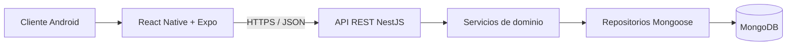
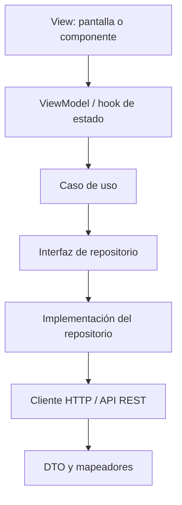

# Arquitectura de INHALEX Móvil

## Vista general

INHALEX conservará una arquitectura **cliente-servidor**. La aplicación Android será un cliente de la API REST existente; NestJS concentrará autenticación, reglas de negocio, autorización y acceso a MongoDB.

La aplicación no tendrá acceso directo a MongoDB. Esta separación evita exponer credenciales, centraliza las validaciones y permite reutilizar el backend desplegado en Render.

## Organización interna de la aplicación

Se usará una organización **feature-first** inspirada en Clean Architecture, con MVVM en presentación y Repository en acceso a datos.

### Capa de presentación

Contiene rutas, pantallas, componentes y ViewModels o hooks. Su responsabilidad es representar estados como carga, éxito, vacío y error, además de transformar las acciones del usuario en llamadas a casos de uso.

### Capa de dominio

Contiene entidades, contratos de repositorio y casos de uso. No depende de React Native, Expo ni de detalles HTTP. Ejemplos: `ObtenerCatalogo`, `AgregarFavorito`, `CrearPedido` y `ConfirmarRecepcion`.

### Capa de datos

Implementa los contratos del dominio. Consume la API REST, transforma DTO en entidades y normaliza errores. El patrón **Repository** permite que la presentación desconozca si la información proviene de HTTP, caché o almacenamiento local.

### Núcleo compartido

Incluye el cliente HTTP, variables de entorno, almacenamiento seguro, tema visual y utilidades transversales. No debe contener reglas propias de una funcionalidad concreta.

## Reglas de dependencia

1. `presentation` puede depender de `domain`.
2. `data` implementa contratos definidos en `domain`.
3. `domain` no depende de `presentation` ni de `data`.
4. Un módulo funcional no accede directamente a archivos internos de otro módulo; comparte contratos mediante `shared` cuando sea necesario.
5. Las respuestas de la API se convierten mediante mapeadores y no se propagan sin control a las vistas.

## Estado, errores y conectividad

- Cada operación mostrará estados explícitos de carga, éxito, vacío y error.
- Los errores HTTP se convertirán a mensajes de dominio comprensibles.
- Los errores 401 provocarán limpieza controlada de la sesión y redirección al acceso.
- Las operaciones de compra no se considerarán exitosas hasta recibir confirmación del backend.
- Una caché futura podrá mejorar lectura del catálogo, pero no sustituirá validaciones de precio, inventario o pedidos.

## Seguridad

- Tokens en almacenamiento cifrado mediante `expo-secure-store`.
- Comunicación exclusiva con endpoints HTTPS en producción.
- Variables públicas de Expo limitadas a configuración no secreta.
- Sin credenciales de MongoDB, JWT secrets ni llaves privadas dentro del cliente.
- Validación de identidad, propiedad de recursos y roles en NestJS.

## Estrategia de pruebas

- **Unitarias:** casos de uso, mapeadores, validadores y ViewModels.
- **Componentes:** renderizado, estados y acciones principales.
- **Integración:** repositorios con respuestas simuladas de la API.
- **Flujo crítico:** registro/acceso, bolsa, creación de pedido y consulta de estado.
- **Aceptación Android:** dispositivo físico o emulador antes de cada versión candidata.

## Decisiones registradas

- Plataforma inicial: Android.
- Framework: React Native con Expo y TypeScript.
- Backend reutilizado: NestJS.
- Persistencia central: MongoDB mediante el backend.
- Patrón de acceso a datos: Repository.
- Patrón de presentación: MVVM apoyado en hooks/ViewModels.
- Integración: API REST mediante HTTPS y JSON.
